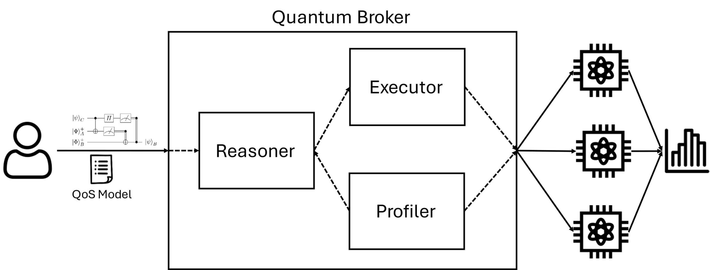

# Quantum Broker (QB)

## Overview

Quantum Broker (QB) is an open-source framework for Quality-of-Service (QoS)-aware quantum execution management. It enables quantum software engineers to specify and enforce QoS requirements (constraints, optimization goals, preferences) across heterogeneous, multi-provider quantum infrastructures in a portable, resilient, and adaptable way.

QB automates shot-wise distribution of quantum circuits, orchestrates workload execution, and adapts to backend characteristics and user goals. It supports modular, provider-agnostic execution and advanced QoS-driven decision making.

## Features

- **Portability & Flexibility:** Decouples execution logic from provider SDKs and backends.
- **Modular Components:** Quantum Executor, Profiler, Reasoner.
- **Declarative QoS Specification:** Portable, expressive constraints and objectives.
- **Pluggable Reasoners & Profilers:** Extensible decision strategies and profiling.
- **Open-Source Availability:** Community-driven, reproducible framework.

## Architecture


**Architecture Components:**

- **Profiler:** Characterizes backend properties (e.g., fidelity, cost, queue time) via live/static profiling.
- **Reasoner:** Makes adaptive, QoS-driven decisions for backend selection and workload distribution.
- **Quantum Executor:** Handles shot-wise distribution and execution of quantum circuits.


## Supported Providers

- IBM Quantum
- IonQ
- Rigetti
- OQC
- Local simulators (e.g., Aer, Fake backends)

Providers and backends are configured in [`config.ini`](config.ini:1).

## Installation

```bash
pip install -r requirements.txt
```

Requires Python 3.8+.

## Configuration

Example [`config.ini`](config.ini:1):

```ini
[SETTINGS]
shots = 4096
providers = [["local_aer", []]]
backends = [["local_aer", "fake_torino"], ["local_aer", "fake_kyiv"], ["local_aer", "fake_sherbrooke"], ["local_aer", "fake_fez"], ["local_aer", "fake_marrakesh"]]
circuit = circuits/vqe_6.json
optimizer = linear
nonlinear_iterations = 50
nonlinear_annealings = 20
result_folder = results
execute = False
```

- **shots:** Number of shots per execution.
- **providers:** List of quantum providers.
- **backends:** List of provider/backend pairs.
- **circuit:** Path to circuit JSON or QASM file.
- **optimizer:** `linear` or `nonlinear`.
- **result_folder:** Output directory.
- **execute:** Whether to execute dispatch.

## Usage

Run QB from the command line:

```bash
python qb.py config.ini circuits/vqe_6.json
```

- `config.ini`: Configuration file.
- `circuits/vqe_6.json`: Quantum circuit and scenario.

### Scenario Walkthrough

Example circuit file: [`circuits/vqe_6.json`](circuits/vqe_6.json:1)

```json
{
  "algorithm": "vqe",
  "size": 6,
  "qasm": "OPENQASM 2.0; ..."
}
```

QB will optimize shot distribution, select backends, and execute according to your config and model.
### Example Dispatch Result

After running QB, a typical dispatch result (from the output JSON) looks like:

```json
{
  "dispatch": {
    "local_aer": {
      "fake_torino": [
        {"shots": 1000, "status": "completed", "result": {"001110": 950, "000110": 50}},
        {"shots": 500, "status": "completed", "result": {"001110": 480, "000110": 20}}
      ],
      "fake_kyiv": [
        {"shots": 800, "status": "completed", "result": {"001110": 780, "001100": 20}}
      ]
    }
  },
  "score": 0.95,
  "evaluation": 0.93,
  "solver_exec_time": 2.34,
  "status": "solution_found"
}
```

- Each backend receives a number of shots and returns results per measurement outcome.
- The dispatch includes status, results, and summary metrics.

## QML (QoS Model Language)

QB uses a declarative QoS Model Language (QML) for constraints and objectives in your model JSON.

### Variables

- `shots`, `used`, `cost`, `execution_time`, `waiting_time`, `fidelity`, `total_shots`, `weights`

### Functions

- `sum(expr)`, `max(expr)`, `min(expr)`

### Operators

- `+`, `-`, `*`, `/`, `**`, comparison (`<=`, `>=`, `<`, `>`, `==`, `!=`)

### Backend Indexing

- By index: `shots[0] >= 100`
- By name: `shots["fake_torino"] >= 100`

### Example Constraints

- `sum(cost * shots) <= 5000`
- `max(execution_time + waiting_time) <= 1500`
- `min(fidelity) >= 0.9`
- `sum(used) >= 2`
- `shots[0] >= 100`
- `shots["fake_torino"] >= 100`

### Example Objective Functions

- `sum(shots * cost)`
- `max(execution_time + waiting_time)`
- `time_weight * max(execution_time + waiting_time) + cost_weight * sum(cost)`
- `sum(used)`

### Full Example

```json
{
  "params": {
    "total_shots": 1000,
    "weights": {"cost_weight": 0.7, "time_weight": 0.3},
    "constraints": [
      "sum(cost) <= 2500",
      "max(execution_time + waiting_time) <= 1200",
      "min(fidelity) >= 0.9",
      "shots[\"b1\"] >= 100"
    ],
    "objective": "cost_weight * sum(cost) + time_weight * max(execution_time + waiting_time)"
  }
}
```

See [`docs/model_expression_reference.md`](docs/model_expression_reference.md:1) for the full QML reference.


## License
This project is licensed under the Apache License, Version 2.0. See the `LICENSE` file for the full text.
